# Assignment 3: SolSplits Protocol Architecture Diagrams

**Author:** Sailesh  

---

## Protocol POC Requirements

- The protocol shall allow users to create revenue splits through Twitter/Farcaster commands
- The protocol shall support natural language processing for split creation commands
- The protocol shall authenticate users through both Twitter/Farcaster Auth and Solana wallet signatures
- The protocol shall support multiple participants in a single split arrangement
- The protocol shall integrate with Jupiter DEX for automatic token swaps before splitting
- The protocol shall store split arrangements in Solana PDAs with deterministic addressing
- The protocol shall support time-locked vesting schedules for split recipients
- The protocol shall provide a web dashboard for split management and analytics
- The protocol shall support batch processing of multiple splits simultaneously
- The protocol shall implement emergency pause functionality for security incidents

---

## Overview

```mermaid
graph TB
    subgraph "User Layer"
        User["👤 User"]
    end
    
    subgraph "Interface Layer"
        TwitterFC["🐦 Twitter/Farcaster Interface<br/>Command Processing"]
        Frontend["💻 Web Dashboard<br/>Management & Analytics"]
    end
    
    subgraph "AI & Authentication Layer"
        AI["🤖 Eliza AI<br/>Natural Language Processing"]
        Auth["🔐 Privy Auth<br/>Social + Wallet Authentication"]
    end
    
    subgraph "Blockchain Layer"
        Program["⛓️ SolSplits Program<br/>Revenue Splitting Logic"]
    end
    
    User -->|1 - Posts Command| TwitterFC
    User -->|View Status| Frontend
    TwitterFC -->|2 - AI Processing| AI  
    AI -->|3 - Authentication| Auth
    Auth -->|4 - Create Split| Program
    Program -->|5 - Update Status| Frontend
    Frontend -->|6 - Notification| User
    Program -->|Success Response| AI
    AI -->|Reply Tweet/Cast| TwitterFC
```

**Core Flow:**
1. User posts Twitter/Farcaster command: "@solsplits create split 60% me, 40% @alice for $500 USDC"
2. AI processes natural language and extracts parameters
3. Authentication verifies both Twitter/Farcaster identity and wallet ownership
4. Solana program creates split arrangement and handles fund distribution
5. Web dashboard displays transaction confirmation and split details
6. User receives success notification via Twitter and web interface

---

## Create Split via Twitter Command

```mermaid
flowchart TD
    User["User posts Twitter or Farcaster command"]
    
    Process["🤖 AI Command Processing<br/>- Extract participants<br/>- Parse percentages<br/>- Validate amount"]
    
    Auth{"🔐 Authentication Valid?<br/>- Twitter/Farcaster OAuth<br/>- Wallet signature check"}
    
    CreatePDAs["🏗️ Create Split PDAs<br/>- User Registry PDA<br/>- Split Arrangement PDA<br/>- Escrow Account PDA"]
    
    Transfer["💰 Transfer to Escrow<br/>- Transfer tokens to escrow<br/>- Update split status<br/>- Set to 'funded'"]
    
    Success["✅ Success Response<br/>- Post success tweet<br/>- Update web dashboard"]
    
    Error["❌ Error Response<br/>- Post error message<br/>- Provide helpful guidance"]
    
    User --> Process
    Process --> Auth
    Auth -->|Yes| CreatePDAs
    Auth -->|No| Error
    CreatePDAs --> Transfer
    Transfer --> ValidateBalance{"Sufficient<br/>token balance?"}
    ValidateBalance -->|Yes| Success
    ValidateBalance -->|No| InsufficientFunds["💸 Insufficient Funds<br/>- Post insufficient funds error<br/>- Show required vs available<br/>- Suggest funding wallet"]
```

**Process Details:**
- Command parsing extracts participants, percentages, token amounts
- Twitter Auth and wallet signature validation required
- PDAs created with deterministic seeds for each split arrangement
- Tokens transferred to escrow account with automated release logic
- Success confirmation posted to both Twitter and web dashboard

---

## Execute Distribution

```mermaid
flowchart TD
    Trigger["🚀 Distribution Trigger<br/>- Manual trigger<br/>- Automatic trigger"]
    
    Validate["✅ Validate Arrangement<br/>- Validate split arrangement<br/>- Check escrow balance<br/>- Verify participant accounts"]
    
    Swap{"🔄 Token Swap Required?<br/>- Check target mint<br/>- Evaluate swap necessity"}
    
    Jupiter["🔄 Jupiter DEX Integration<br/>- Swap tokens to target mint<br/>- Optimize for best rates<br/>- Execute swap transaction"]
    
    Calculate["📊 Calculate Split Amounts<br/>- Apply percentage allocations<br/>- Account for fees<br/>- Precision handling"]
    
    Distribute["💸 Distribute Tokens<br/>- Transfer to participant accounts<br/>- Update split status<br/>- Record transactions"]
    
    Complete["🎉 Split Completed<br/>- Emit distribution event<br/>- Update dashboard<br/>- Send notifications"]
    
    Trigger --> Validate
    Validate --> Swap
    Swap -->|Yes| Jupiter
    Swap -->|No| Calculate
    Jupiter --> ValidateSwap{"Swap<br/>successful?"}
    ValidateSwap -->|Yes| Calculate
    ValidateSwap -->|No| SwapError["🚨 Swap Failure<br/>- Handle swap failure<br/>- Retry with different route<br/>- Or skip swap step"]
    SwapError --> Calculate
    Calculate --> Distribute
    Distribute --> ValidateDist{"✅ All Transfers Successful?<br/>- Verify all transfers<br/>- Check transaction status"}
    ValidateDist -->|Yes| Complete
    ValidateDist -->|No| PartialError["⚠️ Partial Distribution Error<br/>- Handle partial distribution<br/>- Retry failed transfers<br/>- Update split status"]
```

**Distribution Logic:**
- Validates all participant accounts exist and are accessible
- Optional Jupiter DEX integration for token swaps with slippage protection
- Precise percentage calculations with rounding handled fairly
- Atomic distribution ensures all participants receive funds simultaneously

---

## Program Instruction Matrix

**Instruction Flow Patterns:**
- **Account Creation**: initialize_user() → System.create_account() → User Registry PDA
- **Split Setup**: create_split_arrangement() → add_collaborator() → fund_split()
- **Distribution**: execute_distribution() → Jupiter.swap() → SPL.transfer_checked()
- **Advanced Features**: setup_vesting_schedule() → time-locked distributions

---

## Account Management Lifecycle

```mermaid
flowchart TD
    Start["🚀 User Initiates Split Creation<br/>- User triggers split creation<br/>- System begins setup process"]
    
    CreateUser{"👤 User Registry PDA Exists?<br/>- Check for existing registry<br/>- Validate user account"}
    
    InitUser["🏗️ Initialize User Registry<br/>- CPI: System.create_account()<br/>- Initialize User Registry PDA<br/>- Store Twitter handle hash"]
    
    CreateSplit["🔀 Create Split Arrangement<br/>- CPI: System.create_account()<br/>- Initialize Split Arrangement PDA<br/>- Set creator and split ID"]
    
    AddCollabs["👥 Add Collaborators<br/>- Update Split PDA<br/>- Add collaborator pubkeys<br/>- Set percentage allocations"]
    
    CreateEscrow["🏦 Create Escrow Account<br/>- CPI: ATA.create()<br/>- Create escrow token account<br/>- PDA as authority"]
    
    FundEscrow["💰 Fund Escrow<br/>- CPI: SPL.transfer_checked()<br/>- Transfer tokens to escrow<br/>- Update split status to 'funded'"]
    
    ReadyDist["✅ Ready for Distribution<br/>- Split ready for distribution<br/>- All accounts created<br/>- Funds secured in escrow"]
    
    Start --> CreateUser
    CreateUser -->|No| InitUser
    CreateUser -->|Yes| CreateSplit
    InitUser --> CreateSplit
    CreateSplit --> AddCollabs
    AddCollabs --> CreateEscrow
    CreateEscrow --> FundEscrow
    FundEscrow --> ReadyDist
```

**Account State Transitions:**
1. **Creation Phase**: System program creates PDA accounts with proper rent allocation
2. **Configuration Phase**: Split PDA updated with participant and percentage data
3. **Funding Phase**: SPL tokens transferred to escrow with PDA as authority
4. **Distribution Phase**: Automated token distribution to all participants

---

## System Architecture

```mermaid
graph TB
    subgraph "Frontend Layer"
        SocialUI["🐦 Twitter & Farcaster Interface<br/>- Command processing<br/>- Status updates<br/>- Error handling"]
        WebApp["💻 Web Dashboard<br/>- Split management<br/>- Analytics<br/>- User settings"]
    end
    
    subgraph "AI & Auth Layer"
        Eliza["🤖 Eliza AI Framework<br/>- Natural language processing<br/>- Command validation<br/>- Context management"]
        Privy["🔐 Privy Authentication<br/>- Twitter/Farcaster OAuth<br/>- Wallet connection<br/>- Session management"]
    end
    
    subgraph "Blockchain Layer"
        SolSplits["⛓️ SolSplits Program<br/>- Split logic<br/>- PDA management<br/>- Distribution execution"]
        Jupiter["🔄 Jupiter DEX<br/>- Token swaps<br/>- Route optimization"]
        SPL["🪙 SPL Token Program<br/>- Token transfers<br/>- Account creation"]
    end
    
    SocialUI --> Eliza
    WebApp --> Eliza
    
    Eliza --> Privy
    Privy --> SolSplits
    
    SolSplits --> Jupiter
    SolSplits --> SPL
```

**Architecture Components:**

**Frontend Layer:**
- Twitter interface handles real-time command processing and user feedback
- Web dashboard provides comprehensive split management and analytics

**AI & Authentication Layer:**
- Eliza AI framework processes natural language commands with high accuracy
- Privy manages both social authentication (Twitter) and crypto wallet connections

**Blockchain Layer:**
- SolSplits program handles core split logic with 4 main PDA types
- Jupiter DEX integration provides optimal token swap routing
- SPL Token program manages all token transfers and account operations

---

## Account Structure

```mermaid
graph TB
    subgraph "Core Account Layer"
        UserReg["👤 User Registry PDA<br/>- Owner: SolSplits Program<br/>- Seeds: [user_registry, user_pubkey]<br/>- Size: 256 bytes<br/>- social_handle_hash: [u8; 32]<br/>- wallet_pubkey: Pubkey<br/>- verification_status: bool<br/>- created_at: i64"]
    end
    
    subgraph "Split Management Layer"
        SplitArr["🔀 Split Arrangement PDA<br/>- Owner: SolSplits Program<br/>- Seeds: [split, creator, split_id]<br/>- Size: 1024+ bytes (dynamic)<br/>- creator: Pubkey<br/>- participants: Vec&lt;Pubkey&gt;<br/>- percentages: Vec&lt;u16&gt;<br/>- status: SplitStatus<br/>- total_amount: u64<br/>- token_mint: Pubkey"]
    end
    
    subgraph "Token Custody Layer"
        Escrow["🏦 Escrow Token Account<br/>- Owner: SPL Token Program<br/>- Authority: Split Arrangement PDA<br/>- Size: 165 bytes (standard)<br/>- mint: Token mint address<br/>- owner: Split PDA authority<br/>- amount: Token balance<br/>- state: Initialized"]
    end
    
    subgraph "Advanced Features Layer"
        Vesting["⏱️ Vesting Schedule PDA<br/>- Owner: SolSplits Program<br/>- Seeds: [vesting, split_key]<br/>- Size: 384 bytes<br/>- beneficiary: Pubkey<br/>- total_amount: u64<br/>- cliff_timestamp: i64<br/>- vesting_period: i64<br/>- released_amount: u64"]
    end
    
    UserReg -->|"Creates"| SplitArr
    SplitArr -->|"Funds secured in"| Escrow
    SplitArr -.->|"Optional: Time-locked"| Vesting
    Vesting -->|"Releases to"| Escrow
```

**Account Relationships & Technical Details:**

**PDA Derivation Process:**
- All program-owned PDAs use canonical bump (255) for deterministic addressing
- User Registry: `find_program_address([b"user_registry", user_pubkey], program_id)`
- Split Arrangement: `find_program_address([b"split", creator, split_id], program_id)`
- Escrow Account: `get_associated_token_address(split_pda, token_mint)`
- Vesting Schedule: `find_program_address([b"vesting", split_key], program_id)`

**Account Ownership Model:**
- **User Registry PDA**: SolSplits program owns account, stores user identity mapping
- **Split Arrangement PDA**: SolSplits program owns account, manages split logic and state
- **Escrow Token Account**: SPL Token Program owns account, Split PDA has authority
- **Vesting Schedule PDA**: SolSplits program owns account, handles time-locked releases

**Data Flow & State Management:**
- User creation triggers deterministic PDA generation with Twitter handle or Farcaster FID hash
- Split creation establishes participant relationships and percentage allocations
- Escrow funding creates SPL token custody with PDA-controlled release mechanisms
- Distribution execution processes payments across all participants atomically

---

## External Integrations

```mermaid
graph LR
    subgraph "External Services"
        SocialAPI["🐦 Twitter & Farcaster APIs<br/>- Webhook processing<br/>- Tweet/Cast posting<br/>- User verification"]
        JupiterAPI["🔄 Jupiter API<br/>- Route calculation<br/>- Price quotes<br/>- Swap execution"]
    end
    
    subgraph "SolSplits Core"
        Core["⛓️ SolSplits Program<br/>- Main business logic<br/>- PDA management<br/>- Cross-program calls"]
    end
    
    subgraph "Solana Programs"
        SPLToken["🪙 SPL Token Program<br/>- Token transfers<br/>- Account creation<br/>- Balance management"]
        SystemProg["⚙️ System Program<br/>- Account creation<br/>- Rent management<br/>- Space allocation"]
    end
    
    SocialAPI --> Core
    JupiterAPI --> Core
    Core --> SPLToken
    Core --> SystemProg
```

**Integration Points:**
- **Twitter API**: Real-time webhook processing for command detection and response posting
- **Jupiter API**: Best-in-class DEX aggregation for optimal token swap execution
- **SPL Token Program**: Standard Solana token operations for secure fund management
- **System Program**: Core Solana functionality for account creation and management

---

## End-to-End User Flow

**1 - User Posts Command:** User tweets or casts "@solsplits create split 60% me, 40% @alice for $500 USDC"

**2 - AI Processing:** Eliza AI framework processes command and extracts split parameters

**3 - Authentication:** Privy validates both Twitter/Farcaster Auth and Solana wallet signatures

**4 - Account Creation:** SolSplits program creates necessary PDAs and initializes split arrangement

**5 - Fund Management:** Tokens transferred to escrow account with automatic distribution logic

**6 - User Notification:** Success confirmation posted to Twitter/Farcaster and web dashboard updated

**Performance Characteristics:**
- End-to-end processing: 2-3 seconds for simple splits
- Complex operations with Jupiter swaps: 3-5 seconds
- Error detection and user feedback: Sub-1 second response
- Web dashboard real-time updates via WebSocket connections